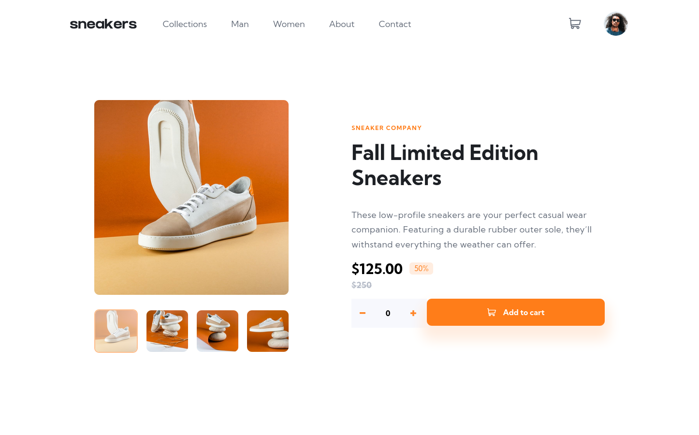
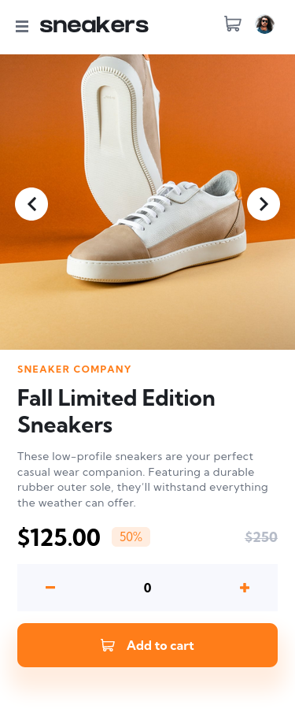

# Shoe-store-product-page
E-commere shoe store page.Responisve-mobile first.

## Table of contents

- [Overview](#overview)
  - [The challenge](#the-challenge)
  - [Screenshot](#screenshot)
  - [Links](#links)
  - [Built with](#built-with)
  - [Useful resources](#useful-resources)
- [Author](#author)

## Overview

### The challenge

Users should be able to:

- View the optimal layout for the site depending on their device's screen size
- See hover states for all interactive elements on the page
- Switch the large product image by clicking on the small thumbnail images
- Add items to the cart
- View the cart and remove items from it

### Screenshot

### Links

- Solution URL: [Solution URL](https://www.frontendmentor.io/solutions/responsive-mobile-first-page-using-sass-1Sptk0nHVz)
- Live Site URL: [lLive site URL here](https://shoe-store-e-commerce.netlify.app/)

### Built with

- Semantic HTML5 markup
- CSS custom properties
- Flexbox
- Mobile-first workflow

### Useful resources

- [Mozilla MDN](https://developer.mozilla.org/en-US/) - Always help with information.
- [Stackoverflow](https://stackoverflow.com/) - Unlimited help :)

## Author

- Website - [Domagoj Baniček](https://github.com/Domagojsk)
- Frontend Mentor - [@DomagojSk](https://www.frontendmentor.io/profile/DomagojSk)
- Twitter - [@DomagojBane](https://www.twitter.com/DomagojBane)
